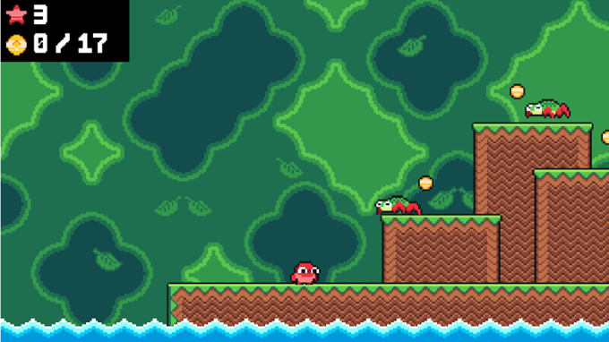

# Mario Game

A **Mario-style 2D platformer game** built with **Kaboom.js** and **JavaScript**, featuring **3 levels**, dynamic enemies, traps, collectibles, smooth camera following, and a complete gameplay flow from **Main Menu → Controls → Levels → Game Over / Win Screen**.

This project uses **tilemap layouts** to design levels, includes animated backgrounds, ambient sounds per level, and multiple enemy behaviors to make gameplay fun and challenging. 

---

## 🎮 Demo 

### ✅ Gameplay 

🔗 **Live Demo:** https://stupendous-granita-9350d7.netlify.app/

---

## ✨ Features

### 🕹️ Core Gameplay
- ✅ Left / Right movement
- ✅ Jump 
- ✅ Collect **coins** to progress
- ✅ Player has a **lives system**
- ✅ Level reload / respawn when damaged or falling

### 🪙 Collectibles & Progression
- 🪙 Collect all coins in a level to unlock the next level automatically  
- ⭐ Lives counter + coin counter displayed on UI
- ✅ When final level coins are completed → **End Game screen** 

### 👾 Enemy & Trap System
Includes multiple enemies and hazards with their own movement patterns:

- 🐟 **Fish**: launches up and down in water areas  
- 🕷️ **Spiders**: crawl and attack with jump behavior 
- 🔥 **Flames**: fireball-like vertical movement hazard  
- 🪓 **Axes**: swinging axe traps with timed animations  
- 🪚 **Saws**: rotating saws moving left & right  
- 🐦 **Birds**: fly and perform dive-attack patterns  

### 🎥 Camera & UI System
- 🎥 Smooth **camera follow system** with offsets and optional fixed axis tracking
- 🖥️ UI displays:
  - Lives count ⭐
  - Coin count 🪙
  - Blinking menu prompts (Press Enter)

### 🔊 Sounds & Background Ambience
Each level has its own background ambience:
- 🌊 Level 1 → Water ambience  
- 🌋 Level 2 → Lava ambience  
- 🌪️ Level 3 → Strong wind ambience  

Sounds are managed using a centralized sound manager.   

---

## 🎮 Controls

| Key | Action |
|-----|--------|
| ⬅️ Left Arrow | Move Left |
| ➡️ Right Arrow | Move Right |
| ⬇️ Down Arrow | Drop through one-way platforms |
| Space | Jump |

Controls are also shown inside the **Controls Menu** in-game. 

---

## 🗺️ Game Levels (3 Levels)

This game includes **3 playable levels**, each built using a **tilemap layout system** where every level is represented as a **2D array of strings**.

Levels use different themes, unique hazards, and different background ambience. 

### 🌿 Level 1 — Forest / Grass Theme
- **Background:** Forest environment  
- **Tileset:** Grass tiles + one-way platforms  
- **Enemies:** Fish + Spiders  
- **Ambience:** Water sound + waves 

### 🔥 Level 2 — Castle / Lava Theme
- **Background:** Castle environment  
- **Tileset:** Brick tiles + one-way platforms  
- **Enemies:** Flames + Spiders  
- **Hazards:** Axes + Saws  
- **Ambience:** Lava sound + lava waves 

### ☁️ Level 3 — Sky / Rock Theme
- **Background:** Multi-layer sky parallax  
- **Tileset:** Rock tiles + one-way platforms  
- **Enemies:** Birds (with dive attacks)  
- **Ambience:** Strong wind + moving clouds 

---

## 🧠 Game Mechanics 

### 👤 Player System
- Player can move, jump, collect coins, and interact with platforms

---

### 💥 Collisions & Damage
- Collision with enemies or traps triggers a **hit sound** and respawn
- Player loses **1 life** each time they respawn
- When lives reach **0** → **Game Over scene** 

---

### 🪂 Falling Detection
If the player falls off the map (y-position too low), they take damage and respawn automatically.

---

### ✅ Winning a Level
- Coin counter UI tracks total coins collected
- When `collected coins == total coins in level` → the next level loads automatically
- Final level completion shows the **You Won** screen 

---

## 🛠️ Tech Stack

- **Kaboom.js** (2D game engine)
- **JavaScript (ES Modules)**
- **Tilemap-based Level Design**
- **Scene-based Game Architecture**
- **Sound + UI Manager System** 

---

## How to run the project ?

Assuming you have `node` installed.
- Install dependencies with `npm install`
- Run locally with `npm run dev`
- Build for production with `npm run build` 

